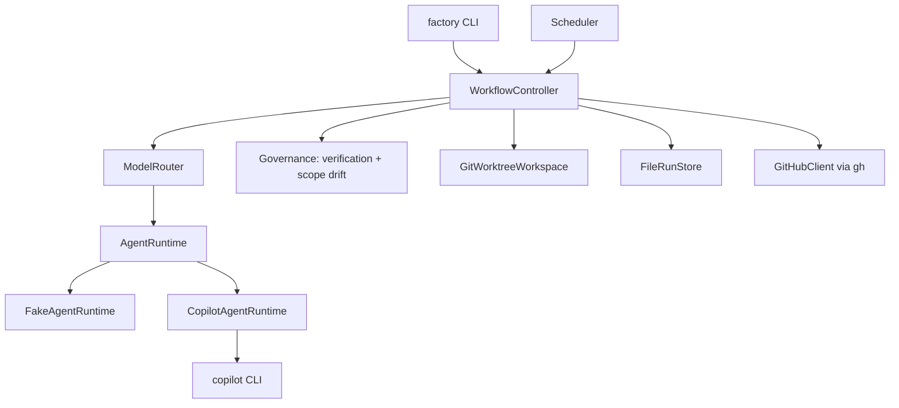

# How it works

A tour of the moving parts. For field-level detail, read
[Architecture](../architecture.md).

## The shape of the system



`WorkflowController` is the only thing that transitions a run. Agents return
artifacts and outcomes; they do not mutate orchestration state. The scheduler
owns claiming and concurrency, and it never mutates a run directly either — it
goes through the controller.

## Workflow states

```text
CREATED
TRIAGING
REFINING
RESEARCHING
PLANNING
IMPLEMENTING
VERIFYING
REVIEWING
PR_READY
PR_CREATED
CI_RUNNING
CI_DIAGNOSIS
DONE
NEEDS_HUMAN
FAILED
```

The allowed transitions are declared as data and enforced on every call:

```text
CREATED      → TRIAGING
TRIAGING     → REFINING
REFINING     → RESEARCHING | PLANNING
RESEARCHING  → PLANNING
PLANNING     → IMPLEMENTING
IMPLEMENTING → VERIFYING
VERIFYING    → REVIEWING | IMPLEMENTING | PLANNING
REVIEWING    → PR_READY | IMPLEMENTING
PR_READY     → PR_CREATED
PR_CREATED   → CI_RUNNING | DONE
CI_RUNNING   → DONE | CI_DIAGNOSIS
CI_DIAGNOSIS → IMPLEMENTING
```

Every non-terminal state may also go to:

- `NEEDS_HUMAN` — a business decision. Eligibility, risk, scope, an exhausted
  budget, or a CI failure that is not repairable.
- `FAILED` — an operational failure. An agent or infrastructure problem.

Terminal states are `DONE`, `NEEDS_HUMAN` and `FAILED`.

There is deliberately no `REPAIRING`, `PLAN_READY` or `BLOCKED` state. Repair is
a bounded transition back to `IMPLEMENTING`, or back to `PLANNING` for scope
drift — not a second workflow. "Blocked" is `NEEDS_HUMAN` with a recorded
reason.

`PR_READY` is not terminal. With pull requests enabled it continues to
`PR_CREATED`. With them disabled it is the completed endpoint of the manual
flow, and the controller finalizes it explicitly.

## Typed artifacts, not one long conversation

Each stage produces a validated artifact and hands it to the next. Nothing
accumulates a giant shared transcript.

```text
WorkItem
  → TriageResult
  → Specification
  → [ResearchReport]
  → ExecutionPlan
  → ChangeSet
  → VerificationReport
  → TestReport
  → ReviewReport
  → [CIReport]
```

They are persisted as versioned JSON in the run directory, with a per-attempt
snapshot under `attempts/NN/`. Writes are atomically replaced, because the
filesystem is the recovery source of truth.

Each agent receives only the context its job needs. That keeps prompts small,
keeps failures attributable, and means a later stage cannot be persuaded by an
earlier stage's narrative.

## The agents

| Agent | Job | Sees |
| --- | --- | --- |
| Triage | Assign complexity, risk, and whether research is needed. | The work item. |
| Specification Refiner | Turn the request into acceptance criteria. | Work item, triage. |
| Researcher | Answer specific open questions. Runs at most once, only when triage asks. | Specification. |
| Planner | Produce an execution plan with an expected scope. | Specification, research. |
| Implementer | Edit the worktree. | Plan, repository. |
| Tester | Judge whether the change is actually tested. | Controller-derived diff, changed files, deterministic results. |
| Reviewer | Independent review. | Controller-derived diff, changed files, deterministic results. |
| Failure Investigator | Diagnose a CI failure. | Normalized CI evidence. |

The tester and reviewer never see the implementer's own summary. That is
deliberate: a model's claim about its work is not evidence.

Research runs; it does not escalate. A researcher that finds nothing useful
returns a report and the run continues.

## Complexity and risk are separate

**Complexity** selects model strength: `L0` through `L3` map to the four
configured worker models. Mechanical work gets a cheap model.

**Risk** selects governance: `R0` through `R3` decide whether a human must
approve, and whether a sensitive scope finding escalates rather than replans.

They do not correlate. A one-line change to an auth check is trivial and high
risk. A large refactor of a test helper is hard and low risk.

## Model routing

`ModelRouter` maps role and complexity to a configured model and reasoning
level. Model names live in configuration, not in the source.

Escalation is bounded: after `retries.same_model_attempts` failures the router
moves to a stronger model, up to `retries.max_total_attempts` total. The chosen
model and the attempt number are persisted on every attempt record, so routing
can be calibrated later against real success and cost data.

## Deterministic gates

Before any model judges the change, the factory computes:

- the Git diff and the changed file list, from the worktree
- `install`, `verify` and `build` results from your configured commands
- the failure category when a phase fails: lint, type, test, dependency or build
- scope drift against the plan's expected scope
- protected file matches
- changed-file count against the ceiling

Only after deterministic verification succeeds do the tester and reviewer run.
LLM judgement supplements this evidence. It does not replace it.

## Workspaces

Each work item gets its own Git worktree:

```text
<data_dir>/workspaces/<work-item-id>/
```

Paths are sanitized and contained under the workspace root; cleanup refuses
anything outside it. A short-lived exclusive lock stops two processes owning the
same work item. Workspaces are preserved by default so you can inspect the
change afterwards.

The `WorkspaceProvider` interface is small on purpose: `prepare`, `get_path`,
`diff`, `cleanup`. There is no generic remote-worker abstraction.

## Persistence

Filesystem JSON. No database.

```text
<data_dir>/
├── runs/<run-id>/
│   ├── run.json          state, attempts, budgets, lease, timestamps
│   ├── work-item.json
│   ├── triage.json
│   ├── specification.json
│   ├── research.json
│   ├── execution-plan.json
│   ├── change-set.json
│   ├── patch.diff
│   ├── verification.json
│   ├── test-report.json
│   ├── review.json
│   ├── ci.json
│   ├── logs/             per-command output, bounded and redacted
│   └── attempts/NN/      per-attempt snapshots
├── workspaces/
├── locks/
└── logs/factory.log
```

`RunStore` is a small interface — `save_run`, `load_run`, `list_runs`,
`save_artifact`, `load_artifact` — with one implementation, `FileRunStore`. A
`PostgresRunStore` is possible later and deliberately not built now.

Health and metrics are *derived* from these files on demand. There is no counter
store and no time-series database, so metrics can never drift out of sync with
what actually happened.

## Scheduling

Scheduling ownership is separate from SDLC state. `Scheduler` owns reservations,
ordering, bounded concurrency and stall detection entirely in memory. It never
mutates a `FactoryRun`.

`FactoryService` composes the scheduler with the GitHub issue provider and the
workflow controller, dispatching through a thread pool bounded by
`scheduler.max_concurrent_tasks`.

The pattern — poll, reconcile, reserve before dispatch, bound concurrency,
recover from the tracker and the filesystem — comes from OpenAI Symphony. See
[Symphony alignment](../symphony-alignment.md) for what was reused, what was
extended and what was rejected.

## Where to read next

- [Architecture](../architecture.md) — the full document, including every
  artifact's fields.
- [Symphony alignment](../symphony-alignment.md) — the orchestration lineage.
- [Decisions](../decisions.md) — why things are the way they are.
- [Safety and trust boundaries](../reference/safety.md) — what the system will
  not do.
