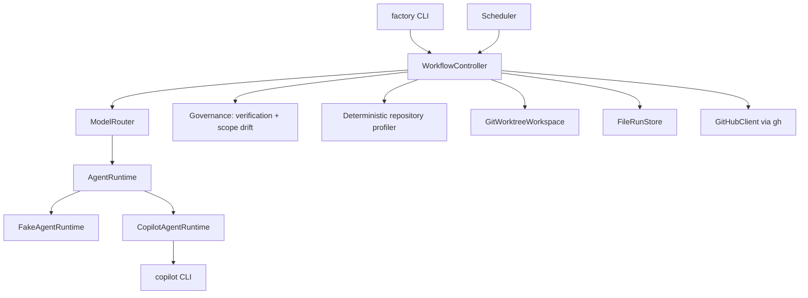

# How it works

A tour of the moving parts. For field-level detail, read
[Architecture](../architecture.md).

## The shape of the system



`WorkflowController` is the only thing that transitions a run. Agents return
artifacts and outcomes. They do not mutate orchestration state. The scheduler
owns claiming and concurrency. It never mutates a run directly. It operates
through the controller.

## Workflow states

```text
CREATED
TRIAGING
REFINING
RESEARCHING
PLANNING
IMPLEMENTING
VERIFYING
REVIEWING
PR_READY
PR_CREATED
CI_RUNNING
CI_DIAGNOSIS
DONE
NEEDS_HUMAN
FAILED
```

The allowed transitions are declared as data and enforced on every call:

```text
CREATED      → TRIAGING
TRIAGING     → REFINING
REFINING     → RESEARCHING | PLANNING
RESEARCHING  → PLANNING
PLANNING     → IMPLEMENTING
IMPLEMENTING → VERIFYING
VERIFYING    → REVIEWING | IMPLEMENTING | PLANNING
REVIEWING    → PR_READY | IMPLEMENTING
PR_READY     → PR_CREATED
PR_CREATED   → CI_RUNNING | DONE
CI_RUNNING   → DONE | CI_DIAGNOSIS
CI_DIAGNOSIS → IMPLEMENTING
```

Every non-terminal state can also transition to:

- `NEEDS_HUMAN`: A business decision. Eligibility, risk, scope, an exhausted
  budget, or a CI failure that is not repairable.
- `FAILED`: An operational failure. An agent or infrastructure problem.

Terminal states are `DONE`, `NEEDS_HUMAN` and `FAILED`.

There is deliberately no `REPAIRING`, `PLAN_READY` or `BLOCKED` state. Repair is
a bounded transition back to `IMPLEMENTING`, or back to `PLANNING` for scope
drift (not a second workflow). "Blocked" is `NEEDS_HUMAN` with a recorded
reason.

`PR_READY` is not terminal. With pull requests enabled it continues to
`PR_CREATED`. With them disabled it is the completed endpoint of the manual
flow, and the controller finalizes it explicitly.

Repository profiling happens after workspace preparation and before
`TRIAGING`, without adding a state. The optional post-green polish re-profiles
the worktree and reuses the stored `RepositorySkill` for the current dependency
fingerprint. It generates guidance through a temporary `RESEARCHING` transition
only when none exists yet. The controller applies the guidance in an
`IMPLEMENTER` attempt through the existing `IMPLEMENTING → VERIFYING`
transition. There is no `POLISHING` state and no fixed skill catalog.

## Typed artifacts, not one long conversation

Each stage produces a validated artifact and hands it to the next. Nothing
accumulates a giant shared transcript.

```text
WorkItem
  → RepositoryProfile
  → TriageResult
  → Specification
  → [ResearchReport]
  → ExecutionPlan
  → ChangeSet
  → VerificationReport
  → TestReport
  → ReviewReport
  → [CIReport]
```

They are persisted as versioned JSON in the run directory, with a per-attempt
snapshot under `attempts/NN/`. Writes are atomically replaced, because the
filesystem is the recovery source of truth.

Each agent receives only the context its job needs. That keeps prompts small,
keeps failures attributable, and means a later stage cannot be persuaded by an
earlier stage's narrative.

`RepositoryProfile` is factory-produced before triage, and again before an
eligible bounded polish attempt. It records detected technologies, test tools,
package managers, markers, warnings, and version files. It also records exact
dependency declarations, a semantic `dependency_fingerprint`, and a
`manifest_fingerprint`. There is no built-in skill catalog.

## The agents

| Agent | Job | Sees |
| --- | --- | --- |
| Triage | Assign complexity, risk, and whether research is needed. | The work item. |
| Specification Refiner | Turn the request into acceptance criteria. | Work item, triage. |
| Researcher | Answer specific open questions, or generate repository-wide guidance (`RepositorySkill`) when the repository's current dependency fingerprint has none yet. | Specification. For skill generation, only the normalized repository profile and configured source lists, with no repository access, no changed filenames, and no task prose. |
| Planner | Produce an execution plan with an expected scope. | Specification, research. |
| Implementer | Edit the worktree. | Plan and repository. Effective repository guidance (stored skill plus human overlay) is provided only during the bounded polish attempt. |
| Tester | Judge whether the change is actually tested. | Work item, specification, execution plan, controller-derived diff, changed files, and deterministic results. Guidance matches the polish Implementer while current. |
| Reviewer | Independent review. | Work item, specification, execution plan, controller-derived diff and changed files, deterministic results, independent TestReport, implementation snapshot number, and typed open review findings. A repair review also receives the exact diff since the previous reviewed tree. Guidance matches the polish Implementer while current. |
| Failure Investigator | Diagnose a CI failure. | Normalized CI evidence. |

The tester and reviewer never see the implementer's own summary. That is
deliberate: a model's claim about its work is not evidence.

Planner, Tester and Reviewer typed-output failures get bounded same-model
correction attempts. The validation error is passed back as correction context.
Tester and Reviewer corrections do not spend implementation attempts.

The first review establishes typed blockers with exact source locations. The
controller assigns their ids and persists them. A repair review must mark every
open blocker `RESOLVED`, `UNRESOLVED` or `WITHDRAWN`. Repair regressions join
the open set. One late batch can also be adopted so a serious missed defect is
not silently accepted, but later drip-fed findings are advisory. Repeated
blockers on one path, one unresolved id, or repeated blocker replacement stop
early with `review-impasse.json`.

Research runs, but it does not escalate. A researcher that finds nothing useful
returns a report and the run continues.

Triage, Refiner and the initial Researcher call receive no skill context.
Skills and overlays never change tools, models, commands, states, retry
budgets, permissions, gates, dependencies or scope.

## Repository capabilities

The controller scans repository-local paths and a small allowlist of bounded
manifests. It never executes a command, imports target code or contacts the
network. It captures exact dependency evidence. This records package names,
declared versions, manifests, and resolved lockfile versions.

On the Python side that means `pyproject.toml` (PEP 621 dependency tables,
`dependency-groups`, `requires-python`, and the Poetry dependency, dev and
group tables), `requirements.txt`/`requirements-*.txt` for pip projects, and
`setup.cfg`/`tox.ini` for pytest evidence. On the JavaScript side it means
`package.json` runtime, dev, peer and optional dependencies plus
`packageManager`. Exact versions come from `uv.lock`, `package-lock.json` and
`pnpm-lock.yaml`. The files `poetry.lock`, `yarn.lock` and `bun.lock` identify
the package manager and are fingerprinted, but are not parsed for exact
versions.

There is no fixed skill catalog. Guidance for the polish attempt comes from two
artifacts: a `RepositorySkill` generated by the configured Researcher, and an
optional overlay you write yourself. Both live under the factory data
directory, in repository-scoped storage keyed by the repository and its
`dependency_fingerprint`, never inside your checkout or its worktree. See
[Repository skills and overlays](../guides/repository-skills.md).

Generated guidance describes the repository as a whole, not the current task,
so it is reused. After the first successful deterministic verification the
controller re-profiles the post-implementation worktree and loads the generated
skill for that fingerprint. When no generated skill exists, the run enters a
temporary `RESEARCHING` state. It asks the configured Researcher
(`Claude Opus 5` by default) to generate one. An existing generated file is
never overwritten. A dependency change selects a new file, and nothing expires
on a timer.

Reuse bounds research per fingerprint, not per process. Two concurrent first
runs for the same missing fingerprint can each make an initial call and one
bounded retry. Invalid output or provenance includes the exact bounded
rejection reason. An infrastructure failure receives one ordinary retry. One
result wins the atomic no-clobber publication, and both runs revalidate that
winner. The race costs at most one extra sequence and changes nothing else. The
repository key derives from the local Git common directory. Moving or
re-cloning a repository starts fresh at a new key. See
[Repository skills and overlays](../guides/repository-skills.md).

That call is deliberately blind. It runs in the run directory instead of the
worktree. Its only tool is `web_fetch`. It sees only the normalized profile and
configured source lists. It never sees changed filenames, source code, README
content, task prose, or the diff. It can fetch:

- `polish.official_documentation_origins`: Official documentation, migration
  guides and release notes (pytest, Python, Node.js, the Python Packaging
  Authority, React, the Testing Library, Vite, Vitest, and TypeScript by default).
  These are authoritative for anything version-specific, and you can extend the
  list with other official origins.
- `polish.practice_reference_urls`: A short list of exact, curated
  general-practice references (by default reviewed `bdfinst/agentic-dev-team`
  notes, pinned to an immutable commit rather than a mutable branch). They
  inform generic quality heuristics only. They never supply version claims,
  commands, tools or orchestration.

The skill is bound to the profile's `dependency_fingerprint` and carries
bounded targets, HTTPS source provenance, separate `simplify` and `polish`
guidance, and uncertainties. The controller checks guidance deterministically
on every load. It validates the fingerprint, targets, and evidence paths. It
also validates framework provenance and checks cited URLs against configured
lists.

Your own house rules go in a repository-level `repository-skill-overlay.yaml`
next to the generated files, outside your repository. It contains prose only,
with `mode: extend` or `mode: replace`, plus optional `simplify` and `polish`
blocks. It contains no targets, sources, versions or fingerprints, so it
survives dependency changes. The factory never creates, rewrites, reformats,
refreshes or deletes it. An invalid overlay is left exactly as you wrote it,
reported as a warning and ignored for that run, while valid generated guidance
still applies.

If profiling, research, or validation fails, the factory records a profile
warning. It then skips or disables polish. Stored guidance that stops
revalidating is left on disk exactly as it is, and the warning tells you to run
`factory skill refresh`. It does not fail the run. Polish is an optional
improvement on an already-verified change. The safe outcome is to ship the
verified change without it.

The effective guidance is applied by one bounded existing Implementer attempt,
simplification first and version-specific polish second, and then the full
deterministic verification runs again. It reaches only the polish Implementer,
Tester and Reviewer, and is never available before the initial green baseline.
Before agents see guidance, the run stores immutable snapshots of the skill,
valid overlay, and provenance metadata. Editing the overlay mid-run affects
later runs only.

## Complexity and risk are separate

**Complexity** selects model strength: `L0` through `L3` map to the four
configured worker models. Mechanical work gets a cheap model.

**Risk** selects governance: `R0` through `R3` decide whether a human must
approve, and whether a sensitive scope finding escalates rather than replans.

They do not correlate. A one-line change to an auth check is trivial and high
risk. A large refactor of a test helper is hard and low risk.

## Model routing

`ModelRouter` maps role and complexity to a configured model and reasoning
level. Model names live in configuration, not in the source.

Implementation escalation is bounded: after
`retries.same_model_attempts` failures the router moves to a stronger model, up
to `retries.max_total_attempts` total. The chosen model and the attempt number
are persisted on every attempt record, so routing can be calibrated later
against real success and cost data.

## Deterministic gates

Before any model judges the change, the factory computes:

- the Git diff and the changed file list, from the worktree
- `install`, `verify` and `build` results from your configured commands
- the failure category when a phase fails: lint, type, test, dependency or build
- scope drift against the plan's expected scope
- protected file matches
- changed-file count against the ceiling

With `polish.enabled`, the first successful verification and scope assessment
schedule at most one more Implementer pass before testing and review. The pass
consumes the implementation budget, can make no edits, never runs during CI
repair, and is always verified again. The tester and reviewer run only after
the final green result. LLM judgement supplements deterministic evidence. It
does not replace deterministic evidence.

## Workspaces

Each work item gets its own Git worktree:

```text
<data_dir>/workspaces/<work-item-id>/
```

Paths are sanitized and contained under the workspace root. Cleanup refuses
anything outside it. A short-lived exclusive lock stops two processes owning the
same work item. Workspaces are preserved by default so you can inspect the
change afterwards.

The `WorkspaceProvider` interface is small on purpose: `prepare`, `get_path`,
`diff`, `cleanup`. There is no generic remote-worker abstraction.

## Persistence

Filesystem JSON. No database.

```text
<data_dir>/
├── runs/<run-id>/
│   ├── run.json          state, attempts, budgets, lease, timestamps
│   ├── work-item.json
│   ├── repository-profile.json
│   ├── triage.json
│   ├── specification.json
│   ├── research.json
│   ├── execution-plan.json
│   ├── change-set.json
│   ├── patch.diff
│   ├── verification.json
│   ├── test-report.json
│   ├── review.json
│   ├── ci.json
│   ├── logs/             per-command output, bounded and redacted
│   └── attempts/NN/      per-attempt snapshots
├── workspaces/
├── locks/
└── logs/factory.log
```

`RunStore` is a small interface with methods `save_run`, `load_run`,
`list_runs`, `save_artifact`, and `load_artifact`. It has one implementation:
`FileRunStore`. A `PostgresRunStore` is possible later and deliberately not
built now.

Health and metrics are *derived* from these files on demand. There is no counter
store and no time-series database, so metrics can never drift out of sync with
what actually happened.

## Scheduling

Scheduling ownership is separate from SDLC state. `Scheduler` owns reservations,
task order, bounded concurrency, and stall detection entirely in memory. It
never mutates a `FactoryRun`.

`FactoryService` composes the scheduler with the GitHub issue provider and
workflow controller. It dispatches runs through a thread pool bounded by
`scheduler.max_concurrent_tasks`.

The pattern of polling, reconciliation, reservation before dispatch, bounded
concurrency, and recovery from the tracker and the filesystem comes from OpenAI
Symphony. See [Symphony alignment](../symphony-alignment.md) for what was
reused, what was extended and what was rejected.

## Where to read next

- [Architecture](../architecture.md): The full document with every artifact
  field.
- [Symphony alignment](../symphony-alignment.md): The orchestration lineage.
- [Decisions](../decisions.md): The reasons for design choices.
- [Safety and trust boundaries](../reference/safety.md): What the system will
  not do.
