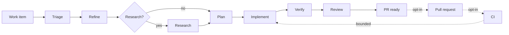

<div class="saf-hero" markdown>

<span class="saf-eyebrow">v0.2.0 · macOS · early</span>

# Software engineering agents with a deterministic controller

Software Agent Factory takes one work item from triage to a reviewed change.
Triage, refinement, research, planning, implementation, verification and review
each run as a separate agent with its own model. The workflow, the retry
budgets and the quality gates are plain Python, not prompts.

Core orchestration runs on your machine: Git worktrees, tests, builds, and all
persisted state. Model calls and GitHub automation are separate opt-in network
features.

<div class="saf-actions" markdown>

[Install](get-started/install.md){ .md-button .md-button--primary }
[Run it offline](get-started/first-run.md){ .md-button }
[Read the architecture](concepts/how-it-works.md){ .md-button }

</div>

</div>

## What a run does

```bash
uv run factory run \
  --repo ~/projects/example \
  --title "Reject empty customer names" \
  --description "Return HTTP 400 for empty or whitespace-only names." \
  --config config/factory.example.yaml
```

```text
run id: run-9bb36bbbdf114f53bd9599a103122976
state: PR_READY
workspace: ~/.software-factory/workspaces/WI-c769695fc242
changed files: FACTORY_NOTES.md
```

That command makes no network calls and costs nothing. The default runtime is
`fake`, a deterministic test double that exercises the whole pipeline without a
model. Add `--runtime copilot` when you want real agents. That costs money.

## The pipeline



Each stage hands the next one a typed, persisted artifact — not a growing chat
transcript. A stage that fails goes back to implementation a bounded number of
times, then escalates to `NEEDS_HUMAN` with the evidence attached.

## Design

<div class="saf-cards" markdown>

<div class="saf-card" markdown>
### Models suggest, code decides
Agents produce artifacts. A single `WorkflowController` owns every state
transition, retry budget and gate. No agent can approve its own work.
[Read more](reference/safety.md)
</div>

<div class="saf-card" markdown>
### Deterministic evidence first
Lint, type checks, tests, build, changed-file scope and the Git diff are
computed by the factory. LLM judgement supplements that evidence; it never
replaces it. [Read more](guides/configure-repository.md)
</div>

<div class="saf-card" markdown>
### Off by default
Pull requests, CI observation and the backlog daemon are all disabled in the
packaged config. With the defaults the factory does no network I/O at all.
[Read more](reference/safety.md)
</div>

<div class="saf-card" markdown>
### Independent review
The tester and reviewer see the controller-derived diff and deterministic
results, never the implementer's own summary. Config rejects a reviewer from
the same model family as any worker. [Read more](concepts/how-it-works.md)
</div>

<div class="saf-card" markdown>
### Isolated workspaces
Every work item gets its own Git worktree under the data directory. Runs,
artifacts and per-attempt snapshots are plain JSON on disk.
[Read more](concepts/how-it-works.md)
</div>

<div class="saf-card" markdown>
### Nothing merges itself
The factory can open a draft pull request and watch CI. It never force-pushes,
never merges and never deploys. [Read more](guides/github.md)
</div>

</div>

## Where to start

| If you want to | Go to |
| --- | --- |
| Install it | [Install](get-started/install.md) |
| See it work without spending money | [First offline run](get-started/first-run.md) |
| Use real models | [Real Copilot runs](get-started/copilot.md) |
| Point it at your repository's checks | [Configure a repository](guides/configure-repository.md) |
| Poll issues, open PRs, watch CI | [GitHub backlog, PRs and CI](guides/github.md) |
| Watch runs and keep it running | [Monitor and run continuously](guides/operations.md) |
| Look up a command or config key | [CLI](reference/cli.md) · [Configuration](reference/configuration.md) |
| Understand the design | [How it works](concepts/how-it-works.md) |

## Status

Early. It works end to end, and the release process, CI and packaging are real.
Treat it as a tool you supervise, not one you leave alone with production
credentials.

- **Platform:** macOS (Apple silicon and Intel). A source checkout needs Python
  3.13+. Other platforms are not tested or supported.
- **Implemented:** phases 0–14 plus Phase 15.0, 15.1, 15.2, 15.5 and 15.11.
- **Deferred:** staging, deployment, Docker or Kubernetes sandboxes, remote
  workers, Postgres, Temporal and non-GitHub trackers.

See [Roadmap and status](project/roadmap.md) for the full table.
