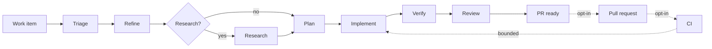

<div class="saf-hero" markdown>

<span class="saf-eyebrow">Latest release {{ factory_release_tag }} · docs track main · macOS · early</span>

# Software engineering agents with a deterministic controller

Software Agent Factory takes one work item from triage to a reviewed change.
Each stage runs as a separate agent with its own model: triage, refinement,
research, plan, implementation, verification, and review. The workflow, the retry
budgets and the quality gates are plain Python, not prompts.

Core orchestration runs on your machine: Git worktrees, tests, builds, and all
persisted state. Model calls and GitHub automation are separate opt-in network
features.

<div class="saf-actions" markdown>

[Install](get-started/install.md){ .md-button .md-button--primary }
[Run it offline](get-started/first-run.md){ .md-button }
[Read the architecture](concepts/how-it-works.md){ .md-button }

</div>

</div>

!!! note
    This site follows the current `main` branch. The latest published package
    is {{ factory_release_tag }}. Newer changes are listed under
    [Unreleased in the changelog](https://github.com/sanjit-roopra/software-agent-factory/blob/main/CHANGELOG.md#unreleased).

## What a run does

```bash
uv run factory run \
  --repo ~/projects/example \
  --title "Reject empty customer names" \
  --description "Return HTTP 400 for empty or whitespace-only names." \
  --config config/factory.example.yaml
```

```text
run id: run-9bb36bbbdf114f53bd9599a103122976
state: PR_READY
workspace: ~/.software-factory/workspaces/WI-c769695fc242
changed files: FACTORY_NOTES.md
```

That command makes no network calls and costs nothing. The default runtime is
`fake`, a deterministic test double that exercises the whole pipeline without a
model. When you want real agents, add `--runtime copilot`. That costs money.

## The pipeline



Each stage hands the next stage a typed, persisted artifact. It does not
pass a growing chat transcript. A stage that fails goes back to
implementation a bounded number of times. Then it escalates to `NEEDS_HUMAN`
with the attached evidence.

## Design

<div class="saf-cards" markdown>

<div class="saf-card" markdown>
### Models suggest, code decides
Agents produce artifacts. A single `WorkflowController` owns every state
transition, retry budget and gate. No agent can approve its own work.
[Read more](reference/safety.md)
</div>

<div class="saf-card" markdown>
### Deterministic evidence first
The factory computes lint, type checks, tests, the build, changed-file scope,
and the Git diff. LLM judgement supplements that evidence.
It never replaces that evidence. [Read more](guides/configure-repository.md)
</div>

<div class="saf-card" markdown>
### Off by default
Pull requests, CI observation and the backlog daemon are disabled in the
packaged configuration. With default settings, the factory does no network
I/O. [Read more](reference/safety.md)
</div>

<div class="saf-card" markdown>
### Independent review
The tester and reviewer see the controller-derived diff and deterministic
results, never the summary of the implementer. Configuration rejects a
reviewer from the same model family as a worker.
[Read more](concepts/how-it-works.md)
</div>

<div class="saf-card" markdown>
### Isolated workspaces
Every work item gets its own Git worktree under the data directory. Runs,
artifacts and per-attempt snapshots are plain JSON on disk.
[Read more](concepts/how-it-works.md)
</div>

<div class="saf-card" markdown>
### Delivery stays under policy
The factory can open pull requests, repair CI, and merge reviewed changes
to an allowlisted target when enabled. It never bypasses branch protection,
force-pushes or deploys. [Read more](guides/github.md)
</div>

</div>

## Where to start

| If you want to | Go to |
| --- | --- |
| Install it | [Install](get-started/install.md) |
| See it work without spending money | [First offline run](get-started/first-run.md) |
| Use real models | [Real Copilot runs](get-started/copilot.md) |
| Point it at your repository's checks | [Configure a repository](guides/configure-repository.md) |
| Customize the guidance agents get | [Repository skills and overlays](guides/repository-skills.md) |
| Poll issues, open PRs, watch CI | [GitHub backlog, PRs and CI](guides/github.md) |
| Watch runs and keep it running | [Monitor and run continuously](guides/operations.md) |
| Look up a command or config key | [CLI](reference/cli.md) · [Configuration](reference/configuration.md) |
| Understand the design | [How it works](concepts/how-it-works.md) |

## Status

Use with supervision only.
The system works end to end. The release process, CI, and packaging are real.

- Platform: macOS (Apple silicon and Intel). A source checkout needs Python
  3.13+. Other platforms are not tested or supported.
- Implemented: phases 0 to 14, plus phases 15.0, 15.1, 15.2, 15.5, and 15.11.
- Deferred: staging, deployment, Docker or Kubernetes sandboxes, remote
  workers, Postgres, Temporal, and non-GitHub trackers.

See [Roadmap and status](project/roadmap.md) for the full table.
